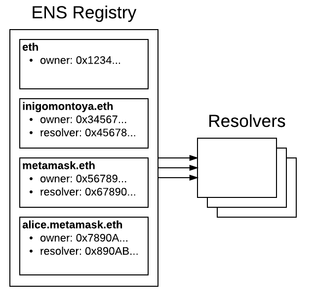
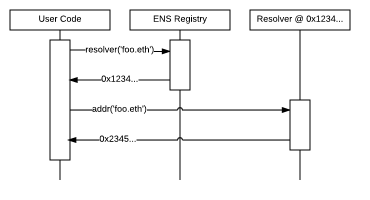

# ENS介绍

ENS（Ethereum Name Service）是以太坊域名服务，是一个基于以太坊区块链的分布式、开放和可扩展的命名系统。

ENS的工作是将人类易读的域名（比如"alice.eth"）解析为计算机可以识别的标识符，如以太坊地址、内容的散列、元数据等。ENS还支持"反向解析"，这使得将元数据(如规范化域名或接口描述)与以太坊地址相关联成为可能。

ENS的目标与DNS（互联网域名服务）类似，但由于以太坊区块链的功能特点和限制条件，两者架构有很大的不同。与DNS一样，ENS是一个层次结构的域名系统，不同层次域名之间以点作为分隔符，我们把层次的名称叫做域，一个域的所有者能够完全控制其子域。

顶级域名（比如".eth"和".test"）的所有者是一种名为"registrar"的智能合约，该合约就是ENS的注册中心，合约内指定了控制子域分配的规则。任何人都可以通过遵循这些合约规定的规则，获得一个域名的所有权并为自己所用。

由于ENS的层次性，不论一个人拥有哪个级别的域名，都可以根据需要为自己或他人配置子域名。例如，如果Alice拥有"alice.eth"，她就可以创建"pay.alice.eth"并按需对其进行设置。

ENS部署在以太坊主网络和几个测试网络上。如果你使用[ethereum-ens](https://www.npmjs.com/package/ethereum-ens) Javascript库或终端用户应用程序，它将自动检测与你交互的网络并在该网络上部署ENS。

你现在就可以通过[ENS管理器](https://manager.ens.domains/)或[ENS官方主页](https://ens.domains/)上的ENS应用程序，来试用ENS。

## ENS架构

ENS有两个主要组件:[注册表](contract-api-reference/ens.md)和[解析器](contract-api-reference/publicresolver.md)。

ENS注册表是一个智能合约，该合约维护所有域和子域的列表，并存储关于每个域的三个关键信息:

> * 域名的所有者
> * 域名的解析器
> * 域名下所有记录的缓存存活时间（即TTL）

域名的所有者可以是外部帐户（用户）或智能合约。注册中心就是一个拥有顶级域名的智能合约，并按照合约中的规则将该域名的子域名分发给用户。

ENS注册表中的域名所有者可以:

> * 为域名设置解析器和TTL
> * 将域名的所有权转移到另一个地址
> * 更改子域名的所有权

ENS注册表非常简单，它的存在只是为了将域名映射到负责解析这个域名的解析器。

解析器负责将域名转换为地址。只要是符合解析器相关标准的智能合约，都可以在ENS中作为解析器程序。通用解析器服务于需求简单的用户，比如不经常更改的地址的用户。

每个记录类型（以太坊地址、内容的散列等）都定义了一个或多个方法，解析器必须实现这些方法才能提供这类记录。新的记录类型可以随时通过EIP标准化程序进行定义，因此不需要为了支持它们而对ENS注册表或现有的解析器进行更改。

在ENS中解析一个域名需要两个步骤：首先，询问注册表负责解析该域名的是哪个解析器，然后，向该解析器查询解析结果。

在上面的例子中，我们试图找到由"foo.eth"指向的以太坊地址。首先，我们询问注册表负责解析“foo.eth”的是哪个解析器。然后，我们向该解析器查询“foo.eth”的地址。

### Namehash

智能合约中的资源限制使得直接与人类易读的域名交互效率低下，因此ENS只使用固定长度的256位加密散列。为了从域名派生出散列的同时仍然保留其层次性，ENS使用了名为Namehash的算法。例如，"alice.eth"的Namehash为 _0x787192fc5378cc32aa956ddfdedbf26b24e8d78e40109add0eea2c1a012c3dec_，Namehash只是用来在ENS内部表示域名。

Namehash是一个递归过程，可以为任何有效的域名生成唯一的散列。从任意一个域名的Namehash开始（比如"alice.eth"的Namehash）可以推导出任意子域名的Namehash（比如"iam.alice.eth"的Namehash），而且推导过程中不需要知道或处理"alice.eth"这个人类易读的原始域名。正是这个特性使得ENS能够成为一个层次性的系统，且不必在内部处理人类易读的文本字符串。

在使用Namehash进行散列之前，首先使用UTS-46标准对域名进行规范化，确保域名中的字母与大小写无关，并禁止使用无效字符。任何对域名进行散列和解析的操作都**必须**首先对其进行规范化，以确保所有用户获得ENS的一致性。

有关Namehash和规范化如何工作的详细信息，请参阅有关[域名处理](contract-api-reference/name-processing.md)的开发人员文档。

## 开始使用

ENS为包括DApp开发人员和合约开发人员在内的各种人员提供参考文档。

#### 我是DApp的开发人员，我想为我的DApp添加ENS支持

从[在DApp中启用ENS](dapp-developer-guide/ens-enabling-your-dapp.md)开始，查看开发应用程序开发人员指南，你可以从众多可用的[ENS库](dapp-developer-guide/ens-libraries.md)中选择一个来开始使用ENS。

#### 我是一名合约开发人员，希望在我的智能合约中与ENS进行交互

从[在链上解析域名](contract-developer-guide/resolving-names-on-chain.md)开始，查看合约开发人员指南。你还可以[编写自己的解析器](contract-developer-guide/writing-a-resolver.md)（自定义查询域名的过程）或自己的[注册中心](contract-developer-guide/writing-a-registrar.md)（自定义注册新域名的过程）。

#### 我想查看ENS智能合约的参考文档

查看ENS智能合约的API参考文档，这些文档涵盖了ENS的核心合约、[注册表](contract-api-reference/ens.md)、[解析器](contract-api-reference/publicresolver.md)和常用的注册中心，如：[测试注册中心](contract-api-reference/testregistrar.md)、[反向注册中心](contract-api-reference/reverseregistrar.md)以及[.eth注册中心](contract-api-reference/.eth-permanent-registrar/)。

