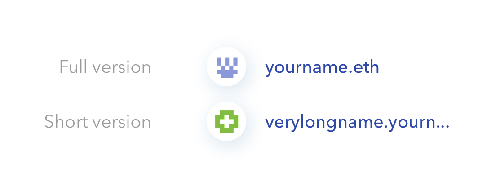
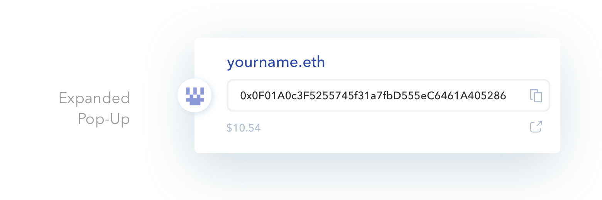
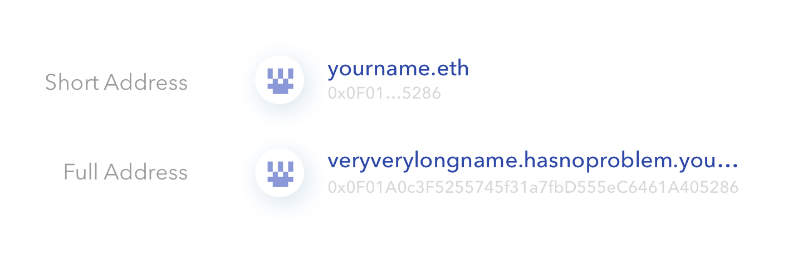
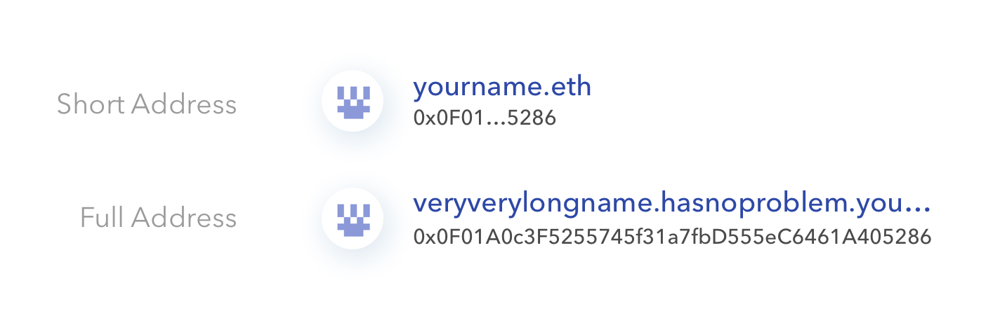

# ENS前端设计指南

### 何时显示ENS域名

在用户可能看到以太坊地址或内容散列的每一个实际场景中，都可以换成ENS域名显示出来。
关于在DApp中向用户显示ENS域名，这里有两个典型用例：

1. **用ENS域名替换以太坊地址**：在供用户浏览和使用的DApp的前端界面中，只要是准备显示以太坊地址的位置，你都可以换成ENS域名来显示。
2. **解析输入的内容**：在那些原本需要输入以太坊地址的文本框里，你可以允许用户直接输入更为易读的ENS域名，而不必非要输入一长串十六进制地址。

除了这些用例，还要记得[ENS公共解析器](../contract-api-reference/publicresolver.md)支持将ENS域名指向[不同类型的资源](../contract-api-reference/publicresolver)（比如：在IPFS或Swarm上存储的内容，或是类似文本内容的任意数据）。因此，还会有一些其他的应用场景会让你想要在DApp中使用ENS。例如，在面对复杂的IPFS或Swarm内容散列时，可以使用ENS将散列转换为可读的域名。[在DApp中启用ENS](ens-enabling-your-dapp.md)一文可以帮你了解更多关于不同用例的信息。

## 1. 用ENS域名替换以太坊地址


只有当用户为其地址设置了一个[反向记录](dapp-developer-guide/resolving-names#reverse-resolution)，并且反向记录（地址 &gt; 域名）能够与[正向解析](dapp-developer-guide/resolving-names#looking-up-ethereum-addresses)（域名 &gt; 地址）完全匹配时，这个ENS域名（作为对应以太坊地址的替代）**才可以被显示出来**。
  
因此，作为DApp开发者，首先应该确认用户是否已经为其地址设置了反向记录。而且，由于用户可以自由设置反向记录，即使不属于他的域名或是其他随机字符也可以设置成功，所以，你还应该确认这个反向解析出的域名也能通过正向解析得到原来的地址。请从[这里](dapp-developer-guide/resolving-names#reverse-resolution)和后面的 _'other guidelines'_ 部分了解更多内容。


### 1.1 - 将以太坊地址换成ENS域名显示

当用ENS域名替换以太坊地址时，你应该考虑以下情况和实践经验:

**添加一个可视校验和：**使用ENS域名时重要的一点就是得向用户指出，这里的域名是指可以关联以太坊地址或其他散列的ENS域名，而不是指http链接。为此，建议将ENS域名与某种形式的可视校验和（比如地址的[标识、Blockies](http://discuss.conflux.network/t/comparing-the-efficacy-of-visual-checksums-identicons-vs-blockies-vs-custom/59)或其他自定义算法表示）相关联。


**可视校验和**像身份识别一样[可以被欺骗](https://medium.com/@austin_48503/vanity-blockie-miner-for-ethereum-902fccf0a427)或模仿，所以它们**不能算是一种安全机制**。它们只是一个标识符，让用户知道这个域名**只是以太坊地址的另一种表示**。


* **设计一个缩略版的ENS域名：**ENS域名可以很长，除了不受字符限制之外，用户还可以创建无限数量的子域名以及子域名的子域名，所以可以考虑设计一个缩略版的ENS域名。如果显示了缩略版的域名，则应该提供查看完整域名的方法，例如在悬停时展开整个域名。
* **不是所有的ENS域名都以.eth结尾：**ENS域名通常以.eth结尾。但是，ENS系统目前已经实现了对.xyz和.luxe这两个顶级域名（TLD）的支持，未来还将支持更多的顶级域名。如果你考虑在缩略版的ENS域名中显示TLD部分，请注意这一点。

### 1.2 - 提供一个可以随时查看与ENS域名关联的以太坊地址的方法

如果要显示ENS的完整域名或缩略版，你应该：

* **始终为用户提供显示完整的以太坊地址的方法：**上面的示例演示了一个弹出选项。还有一个方法是使用提示信息，但是浮动或弹出窗口的方式相比提示信息更为合适，因为前者也具备后者能够实现的特点。
* **提供一个可以同时查看ENS域名及其关联地址的的界面：**相比于弹出窗口只显示地址而隐藏域名的做法，两者同时显示的方式显然对用户更为友好。
* **允许用户复制完整的以太坊地址：**允许用户通过复制按钮或点选的方式来复制完整地址，而且在这个过程中，显示ENS域名的提示信息应该始终保持可见，不会自动关闭。
* **选择性地为用户提供自动在区块浏览器中打开以太坊地址的方法**，比如在Etherscan浏览器打开（上面示例中的外部链接图标）。
* **选择性地显示当前登录用户的余额数量。**研究表明，用户不但通过地址本身，还倾向于通过余额来识别自己的以太坊地址。这只适用于当前"已登录"的用户：只显示他们自己的余额，同时避免显示其他用户的余额。

### 1.3 - 同时显示ENS域名和以太坊地址

有时你可能希望同时显示ENS域名和它解析到的以太坊地址。当遇到下列情况时，这种显示方式就会派上用场：

* **显示当前连接的用户**：例如，用于标识用户时，可以同时显示ENS域名和缩略的以太坊地址。
* **用户向文本框输入ENS域名**：有关内容会在下一节中讨论输入文本解析时进行更详细的描述。
* **在其他高风险情况下**：当用户想要证实某个用户或地址是谁时，或者你注意到用户为了在弹出窗口中查看以太坊地址而持续点击ENS域名时，你就可以用同时显示域名和地址的方式代替只有域名的显示方式。

## 2. 输入文本解析

在用户可以输入以太坊地址的文本框里也应该支持ENS域名的输入和解析，这些输入表明用户希望与另一个用户的以太坊地址或合约进行交互。

通过遵循以下准则，可以建立最好的用户体验:

* **在解析ENS域名之前稍作等待**：等待用户输完最后的TLD（比如.eth、.xyz或.luxe），或者是在用户停止输入后等待0.2-1秒的时间，然后再解析输入的域名（要避免出现[急于解析的问题](https://github.com/MetaMask/metamask-extension/issues/4380)）。
* **不要用以太坊地址覆盖输入的字段**：应该在输入字段附近显示解析后的ENS域名。
* **始终同时显示ENS域名和以太坊地址**：在成功实现该功能后再执行此操作，而且最好是根据准则1.1中的建议添加可视校验和。

## 其他指南和提示

### 如果反向记录和正向解析不能正确对应时该怎么办?

如前所述，用户可以将[反向解析记录](resolving-names.md#fan-xiang-jie-xi)设置为任何内容，甚至是另一个用户拥有的域名或者完全随机的字符串。这就是为什么在查询了写在反向记录中的域名之后，DApp开发者还应该检查它是否匹配正向解析，因为正向解析标明了ENS域名指向的地址。
**如果两者不匹配，就不能显示可读的域名，只能直接显示以太坊地址。**否则，用户可能会在你的DApp中冒充其他用户。
关于反向解析的章节中含有用于此类验证的[代码](dapp-developer-guide/resolving-names#reverse-resolution)。
****

### 关于用户名的显示

最为直接的方式是将用户的ENS域名作为用户名显示。为此，可以让用户在你的子域名下注册一个域名，或者使用反向解析查找用户的ENS域名。

### **缓存和更新ENS域名**

如果你的DApp需要在UI界面中显示许多以太坊地址或ENS域名，你还可以考虑在解析（和验证）该域名后，或是用户在输入字段中添加该域名之后，将这个ENS域名**缓存**起来。 
  
你的**开放式UI**可以在**毫无风险的情况下**安全地显示缓存中的域名，例如，用户只是在浏览，并且不需要根据显示的信息采取行动或做出决策，尤其是有风险的决策。
但是，在所有**存在危险的情况下**（如转移ETH、代币或其他值），或者当用户与另一个ENS域名或以太坊地址交互时，你就应该**直接执行实时解析**，并从ENS注册表中获取最新的信息。
  
此外，考虑到用户可以随时更改ENS注册表中的信息，你还应该**定期验证当前缓存的信息**。为此，你可以订阅相关合约中发生的一些特定**事件**，尤其是[AddrChanged](../contract-api-reference/publicresolver#set-ethereum-address)和[NameChanged](../contract-api-reference/publicresolver#set-canonical-name)。

### 关于显示以太坊地址的说明（无论有没有ENS域名）

研究表明，即使在ENS域名未启用的情况下，在DApps中显示以太坊地址时也有一些好的经验可以借鉴。

* **始终以"0x"开头**，以表明它是一个地址。
* 需要缩略显示域名时，可以**显示地址的前4个和后4个字符**。相对来说，缩略地址更容易被欺骗，所以这并不是一个安全要求，但这是一个很好的经验，因为有些用户检查域名的开头，有些用户检查域名的结尾。而且，我们的大脑可以轻松划分、解析和记忆的字符最多为4个。
* **始终提供一种显示完整以太坊地址的方式。**可以采用与显示ENS域名或提示信息相同的弹出组件。

前面提到的一些经验也适用于缩略的以太坊地址：

* **允许用户复制完整的以太坊地址**（就像前面说到的一样，提示信息可能不是一个好方法）。
* 选择性地为用户提供自动**在区块浏览器中打开以太坊地址**的方法。

## 前端工具

* **ENS Badge** （即将发布）
* **Aragon-UI** - [Address Badge组件](https://github.com/aragon/design/issues/3)（[Design Files](https://github.com/aragon/design) / [代码](https://github.com/aragon/aragon-ui/tree/master/src/components/Badge)）
* **Decentraland-UI** - [地址提示工具](https://ui.decentraland.org/?selectedKind=Address&selectedStory=Tooltip&full=0&addons=1&stories=1&panelRight=0&addonPanel=storybook%2Fstories%2Fstories-panel)（非ENS专用）

